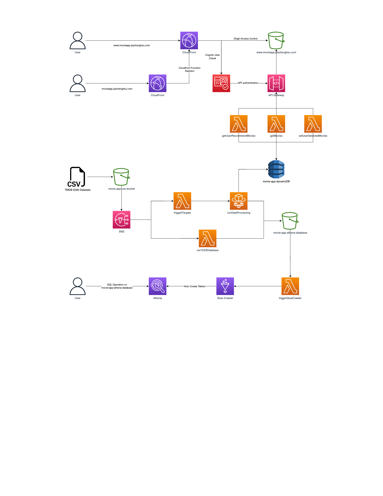

<a name="readme-top"></a>

<!-- PROJECT HOME PAGE -->
<br />
<div align="center">

  

  <h3 align="center">Movie Recommender App</h3>

  <p align="center">
    An awesome README template to jumpstart your projects!
    <br />
    <a>View Demo</a>
    ·
    <a href="https://github.com/andy145155/movie-app/issues">Report Bug</a>
    ·
    <a href="https://github.com/andy145155/movie-app/issues">Request Feature</a>
  </p>
</div>

<!-- TABLE OF CONTENTS -->

## Table of Contents

  <ol>
    <li>
      <a href="#about-the-project">About The Project</a>
      <ul>
        <li><a href="#architecture-on-aws">Architecture on AWS</a></li>
				<li><a href="#built-with">Built With</a></li>
      </ul>
    </li>
    <li>
      <a href="#getting-started">Getting Started</a>
      <ul>
        <li><a href="#prerequisites">Prerequisites</a></li>
        <li><a href="#installation">Installation</a></li>
			  <li><a href="#activating-vs-code-dev-container">Activating VS code dev container</a></li>
      </ul>
    </li>
    <li><a href="#license">License</a></li>
    <li><a href="#contact">Contact</a></li>
    <li><a href="#acknowledgments">Acknowledgments</a></li>
  </ol>

<!-- ABOUT THE PROJECT -->

## About The Project

The Movie Recommender App is a web-based application that allows users to browse and discover movies based on their personal preferences. The app uses a content-based recommender system to suggest movies that are similar to ones the user has liked in the past.

This project was inspired by Sonny Sangha's and CampusX's tutorials on building a movie recommender system using React.js and content-based recommendation techniques. Their guidance and inspiration were instrumental in the creation of this app. You can find their tutorials in the Acknowledgments section of this document.

### Architecture on AWS

  

The Movie Recommender App is fully built with AWS services. The web hosting is done with S3 bucket and CloudFront. User login is handled with AWS Cognito. The API is built with API Gateway and Lambda, and the data is stored in DynamoDB.

In addition, the app uses a dataset of TMDB 5000 movies for its content-based recommendation system. To auto streamline data processing, the app also uses SNS, Lambda, Fargate, Glue Crawlers, and Athena to automatically ingest new data and update the movie recommendations.

### Built With

- [![Python][Python]][Python-url]
- [![TypeScript][TypeScript]][TypeScript-url]
- [![React][React.js]][React-url]
- [![Terraform][Terraform]][Terraform-url]
- [![AWS][AWS]][AWS-url]
- [![Bash][Bash]][Bash-url]
- [![OpenAPI][OpenAPI]][OpenAPI-url]
- [![devContainer][devContainer]][devContainer-url]
- [![Serverless][Serverless]][Serverless-url]

<p align="right">(<a href="#readme-top">back to top</a>)</p>

<!-- GETTING STARTED -->

## Getting Started

To get started with the Movie Recommender App, follow these steps:

### Prerequisites

Before you begin, ensure you have met the following requirements:

- You have installed the latest version of `yarn`.
- You have an AWS account and have configured [AWS CLI](https://docs.aws.amazon.com/cli/latest/userguide/cli-chap-install.html) on your machine.

### Installation

1. Clone the repo

```sh
git clone <https://github.com/andy145155/movie-app.git>
cd movie-app
```

2. Configure your AWS credentials using the `aws configure` command.
3. To deploy the AWS infrastructure using Terraform, run the `yarn deployInfra` command:
4. To deploy any code changes to Lambda, run `yarn deployLambda`. This command will automatically deploy all changes to Lambda.
5. To deploy any code changes to Fargate, run `yarn deployFargate`. This command will automatically deploy all changes to Fargate.
6. To run the data processing stream, run `yarn uploadCsvToS3`. Once the CSV file has been uploaded to the S3 bucket, S3 will trigger SNS and start the data processing stream automatically.
7. To deploy changes to the React website, run `yarn deployMovieApp`. This command will upload new changes to the S3 bucket and distribute them through CloudFront.

### Activating VS code dev container

If you are using VS Code as your IDE, you can take advantage of the dev container to have a consistent development environment across different machines.

1. Make sure you have [Docker](https://docs.docker.com/get-docker/) installed on your machine.
2. Install the [Remote - Containers](https://marketplace.visualstudio.com/items?itemName=ms-vscode-remote.remote-containers) extension in VS Code.
3. Open the project folder in VS Code.
4. Click on the `Reopen in Container` button that appears on the bottom right corner of the window.
5. Wait for the container to build and the project to load in the dev container.
6. You're ready to start developing!

<p align="right">(<a href="#readme-top">back to top</a>)</p>

<!-- CONTACT -->

## Contact

Andy Hsu - andy57291@gmail.com

Project Link: [https://github.com/andy145155/movie-app](https://github.com/andy145155/movie-app)

<p align="right">(<a href="#readme-top">back to top</a>)</p>

<!-- ACKNOWLEDGMENTS -->

## Acknowledgments

I would like to express my gratitude to the sources that I used for this project.

- [Let's build Netflix 2.0 with REACT.JS!](https://www.youtube.com/watch?v=HW5roUF2RLg&t=4146s)
- [Movie Recommender System Project | Content Based Recommender System with Heroku Deployment](https://www.youtube.com/watch?v=1xtrIEwY_zY&t=7607s)

<p align="right">(<a href="#readme-top">back to top</a>)</p>

<!-- LICENSE -->

## License

Distributed under the MIT License. See `LICENSE.txt` for more information.

<p align="right">(<a href="#readme-top">back to top</a>)</p>

<!-- MARKDOWN LINKS & IMAGES -->
<!-- https://www.markdownguide.org/basic-syntax/#reference-style-links -->

[contributors-shield]: https://img.shields.io/github/contributors/github_username/repo_name.svg?style=for-the-badge
[contributors-url]: https://github.com/github_username/repo_name/graphs/contributors
[forks-shield]: https://img.shields.io/github/forks/github_username/repo_name.svg?style=for-the-badge
[forks-url]: https://github.com/github_username/repo_name/network/members
[stars-shield]: https://img.shields.io/github/stars/github_username/repo_name.svg?style=for-the-badge
[stars-url]: https://github.com/github_username/repo_name/stargazers
[issues-shield]: https://img.shields.io/github/issues/github_username/repo_name.svg?style=for-the-badge
[issues-url]: https://github.com/github_username/repo_name/issues
[license-shield]: https://img.shields.io/github/license/github_username/repo_name.svg?style=for-the-badge
[license-url]: https://github.com/github_username/repo_name/blob/master/LICENSE.txt
[linkedin-shield]: https://img.shields.io/badge/-LinkedIn-black.svg?style=for-the-badge&logo=linkedin&colorB=555
[linkedin-url]: https://linkedin.com/in/linkedin_username
[product-screenshot]: images/screenshot.png
[React.js]: https://img.shields.io/badge/React-20232A?style=for-the-badge&logo=react&logoColor=61DAFB
[React-url]: https://reactjs.org/
[TypeScript]: https://img.shields.io/badge/TypeScript-007ACC?style=for-the-badge&logo=typescript&logoColor=white
[TypeScript-url]: https://www.typescriptlang.org/
[Python]: https://img.shields.io/badge/Python-14354C?style=for-the-badge&logo=python&logoColor=white
[Python-url]: https://www.python.org/
[Terraform]: https://img.shields.io/badge/terraform-%235835CC.svg?style=for-the-badge&logo=terraform&logoColor=white
[Terraform-url]: https://www.terraform.io/
[AWS]: https://img.shields.io/badge/Amazon_AWS-FF9900?style=for-the-badge&logo=amazonaws&logoColor=white
[AWS-url]: https://aws.amazon.com/
[Bash]: https://img.shields.io/badge/shell_script-%23121011.svg?style=for-the-badge&logo=gnu-bash&logoColor=white
[Bash-url]: https://www.gnu.org/savannah-checkouts/gnu/bash/manual/bash.html
[Serverless]: http://public.serverless.com/badges/v3.svg
[Serverless-url]: https://www.serverless.com/
[OpenAPI]: https://img.shields.io/badge/-Swagger-%23Clojure?style=for-the-badge&logo=swagger&logoColor=white
[OpenAPI-url]: https://swagger.io/specification/
[devContainer]: https://img.shields.io/badge/Visual%20Studio%20Code-0078d7.svg?style=for-the-badge&logo=visual-studio-code&logoColor=white
[devContainer-url]: https://code.visualstudio.com/docs/devcontainers/containers
