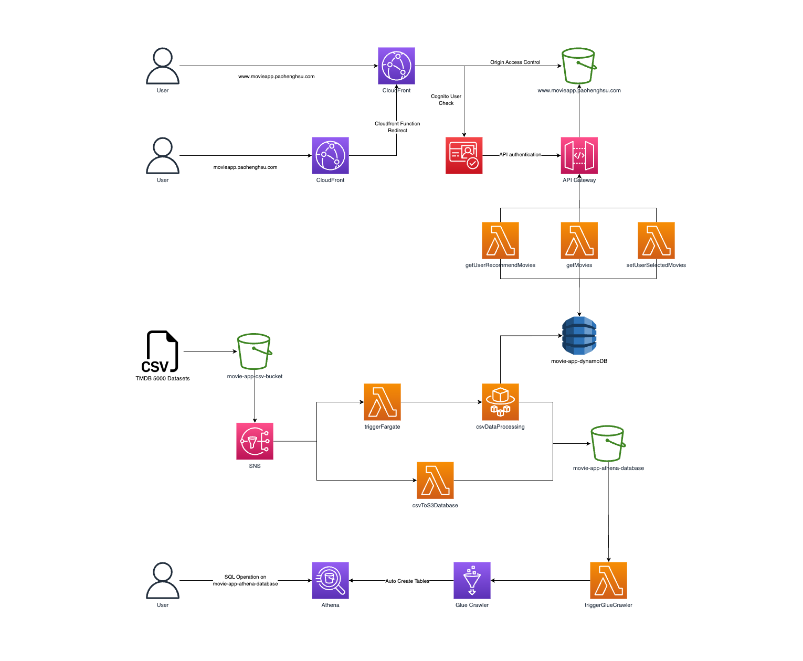

<a name="readme-top"></a>

<!-- PROJECT HOME PAGE -->
<br />
<div align="center">

  

  <h3 align="center">Movie Recommender App</h3>

  <p align="center">
    Personalised Movie Recommendations Just for You
    <br />
    <a href="https://www.movieapp.paohenghsu.com/" target="_blank">View App</a>
    ·
    <a href="https://github.com/andy145155/movie-app/issues">Report Bug</a>
    ·
    <a href="https://github.com/andy145155/movie-app/issues">Request Feature</a>
  </p>
</div>

<!-- TABLE OF CONTENTS -->

## Table of Contents

  <ol>
    <li>
      <a href="#about-the-project">About The Project</a>
      <ul>
        <li><a href="#architecture-on-aws">Architecture on AWS</a></li>
				<li><a href="#built-with">Built With</a></li>
        <li><a href="#movie-datasets">Movie Datasets</a></li>
      </ul>
    </li>
    <li>
      <a href="#getting-started">Getting Started</a>
      <ul>
        <li><a href="#activating-vs-code-dev-container">Activating VS code dev container</a></li>
        <li><a href="#installation">Installation</a></li>
      </ul>
    </li>
    <li><a href="#license">License</a></li>
    <li><a href="#contact">Contact</a></li>
    <li><a href="#acknowledgments">Acknowledgments</a></li>
  </ol>

<!-- ABOUT THE PROJECT -->

## About The Project

The Movie Recommender App is a web-based application that allows users to browse and discover movies based on their personal preferences. The app uses a content-based recommender system to suggest movies that are similar to ones the user has liked in the past.

### Architecture on AWS

  

The Movie Recommender App uses several AWS services to function. It utilizes S3 bucket and CloudFront for web hosting, AWS Cognito for user login, and API Gateway and Lambda for the API. Cognito verifies the authorization of the API. The app also stores processed movie and user data in DynamoDB.

To trigger the automated event-driven data processing pipeline, users can import the TMDB5000 dataset to the S3 bucket. The app also uses SNS, Lambda, Fargate, Glue Crawlers, and Athena to streamline data processing and automatically ingest new data to update movie recommendations. All processed data is stored in the S3 bucket for Athena SQL investigation.

### Built With

- [![Python][Python]][Python-url]
- [![TypeScript][TypeScript]][TypeScript-url]
- [![React][React.js]][React-url]
- [![Terraform][Terraform]][Terraform-url]
- [![AWS][AWS]][AWS-url]
- [![Bash][Bash]][Bash-url]
- [![OpenAPI][OpenAPI]][OpenAPI-url]
- [![devContainer][devContainer]][devContainer-url]
- [![Serverless][Serverless]][Serverless-url]

### Movie Datasets

The Movie Recommender App uses the [TMDB 5000 movie dataset](https://www.kaggle.com/datasets/tmdb/tmdb-movie-metadata), which includes information on over 5,000 movies, including their titles, genres, release dates, production companies, and user ratings. To extract useful information from this dataset, we use content-based filtering techniques that analyze the features of movies that users have previously enjoyed and then suggest similar movies.

<p align="right">(<a href="#readme-top">back to top</a>)</p>

<!-- GETTING STARTED -->

## Getting Started

To start using the Movie Recommender App, follow these steps:

Note that you will need your own domain name to fully reproduce the app on your own.

### Activating VS code dev container

If you are using VS Code as your IDE, you can take advantage of the dev container to have a consistent development environment across different machines.

1. Make sure you have [Docker](https://docs.docker.com/get-docker/) installed on your machine.
2. Install the [Remote - Containers](https://marketplace.visualstudio.com/items?itemName=ms-vscode-remote.remote-containers) extension in VS Code.
3. Open the project folder in VS Code.
4. Click on the `Reopen in Container` button that appears on the bottom right corner of the window.
5. Wait for the container to build and the project to load in the dev container.
6. You're ready to start developing!

### Installation

1. Clone the repo

```sh
git clone <https://github.com/andy145155/movie-app.git>
cd movie-app
```

2. Configure your AWS credentials by following [AWS Configuration and credential file settings guidelines](https://docs.aws.amazon.com/cli/latest/userguide/cli-configure-files.html).
3. To deploy the AWS infrastructure using Terraform, run the following command

```sh
yarn deployInfra
```
4. To deploy any code changes to Lambda, run the following command.

```sh
yarn deployLambda
```
5. To deploy any code changes to Fargate, run the following command.

```sh
yarn deployFargate
```

6. To run the data processing stream, run the following command.. Once the CSV file has been uploaded to the S3 bucket, S3 will trigger SNS and start the data processing stream automatically.

```sh
yarn uploadCsvToS3
```

7. To deploy changes to the React website, run the following command. This command will upload new changes to the S3 bucket and distribute them through CloudFront.

```sh
yarn deployMovieApp
```

<p align="right">(<a href="#readme-top">back to top</a>)</p>

<!-- CONTACT -->

## Contact

Andy Hsu - andy57291@gmail.com

Project Link: [https://www.movieapp.paohenghsu.com/](https://www.movieapp.paohenghsu.com/)

<p align="right">(<a href="#readme-top">back to top</a>)</p>

<!-- ACKNOWLEDGMENTS -->

## Acknowledgments

I would like to express my gratitude to the sources that I used for this project.

- [Let's build Netflix 2.0 with REACT.JS!](https://www.youtube.com/watch?v=HW5roUF2RLg&t=4146s)
- [Movie Recommender System Project | Content Based Recommender System with Heroku Deployment](https://www.youtube.com/watch?v=1xtrIEwY_zY&t=7607s)

<p align="right">(<a href="#readme-top">back to top</a>)</p>

<!-- LICENSE -->

## License

Distributed under the MIT License. See `LICENSE.txt` for more information.

<p align="right">(<a href="#readme-top">back to top</a>)</p>

<!-- MARKDOWN LINKS & IMAGES -->
<!-- https://www.markdownguide.org/basic-syntax/#reference-style-links -->

[contributors-shield]: https://img.shields.io/github/contributors/github_username/repo_name.svg?style=for-the-badge
[contributors-url]: https://github.com/github_username/repo_name/graphs/contributors
[forks-shield]: https://img.shields.io/github/forks/github_username/repo_name.svg?style=for-the-badge
[forks-url]: https://github.com/github_username/repo_name/network/members
[stars-shield]: https://img.shields.io/github/stars/github_username/repo_name.svg?style=for-the-badge
[stars-url]: https://github.com/github_username/repo_name/stargazers
[issues-shield]: https://img.shields.io/github/issues/github_username/repo_name.svg?style=for-the-badge
[issues-url]: https://github.com/github_username/repo_name/issues
[license-shield]: https://img.shields.io/github/license/github_username/repo_name.svg?style=for-the-badge
[license-url]: https://github.com/github_username/repo_name/blob/master/LICENSE.txt
[linkedin-shield]: https://img.shields.io/badge/-LinkedIn-black.svg?style=for-the-badge&logo=linkedin&colorB=555
[linkedin-url]: https://linkedin.com/in/linkedin_username
[product-screenshot]: images/screenshot.png
[React.js]: https://img.shields.io/badge/React-20232A?style=for-the-badge&logo=react&logoColor=61DAFB
[React-url]: https://reactjs.org/
[TypeScript]: https://img.shields.io/badge/TypeScript-007ACC?style=for-the-badge&logo=typescript&logoColor=white
[TypeScript-url]: https://www.typescriptlang.org/
[Python]: https://img.shields.io/badge/Python-14354C?style=for-the-badge&logo=python&logoColor=white
[Python-url]: https://www.python.org/
[Terraform]: https://img.shields.io/badge/terraform-%235835CC.svg?style=for-the-badge&logo=terraform&logoColor=white
[Terraform-url]: https://www.terraform.io/
[AWS]: https://img.shields.io/badge/Amazon_AWS-FF9900?style=for-the-badge&logo=amazonaws&logoColor=white
[AWS-url]: https://aws.amazon.com/
[Bash]: https://img.shields.io/badge/shell_script-%23121011.svg?style=for-the-badge&logo=gnu-bash&logoColor=white
[Bash-url]: https://www.gnu.org/savannah-checkouts/gnu/bash/manual/bash.html
[Serverless]: http://public.serverless.com/badges/v3.svg
[Serverless-url]: https://www.serverless.com/
[OpenAPI]: https://img.shields.io/badge/-Swagger-%23Clojure?style=for-the-badge&logo=swagger&logoColor=white
[OpenAPI-url]: https://swagger.io/specification/
[devContainer]: https://img.shields.io/badge/Visual%20Studio%20Code-0078d7.svg?style=for-the-badge&logo=visual-studio-code&logoColor=white
[devContainer-url]: https://code.visualstudio.com/docs/devcontainers/containers
